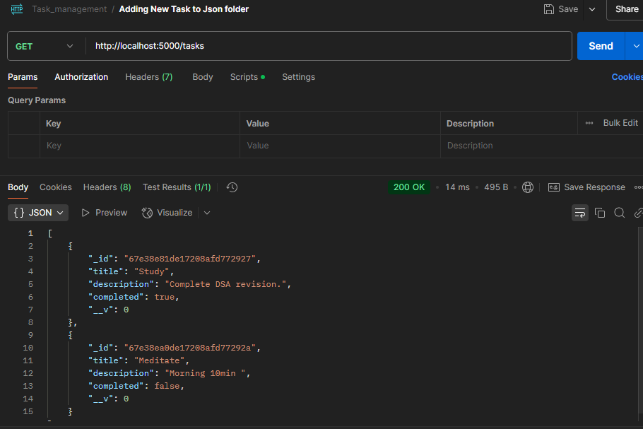
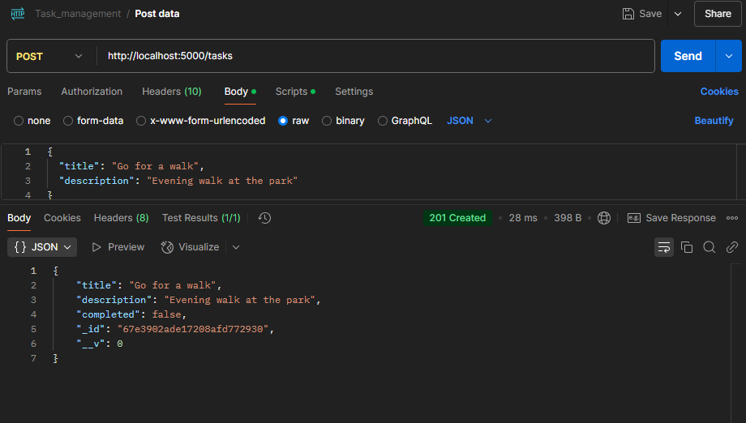
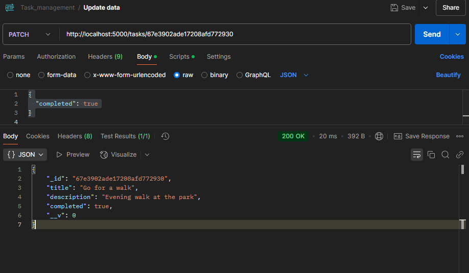
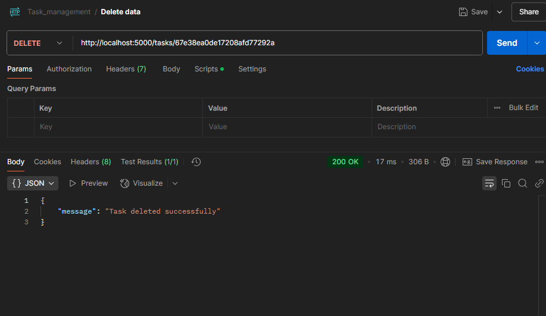
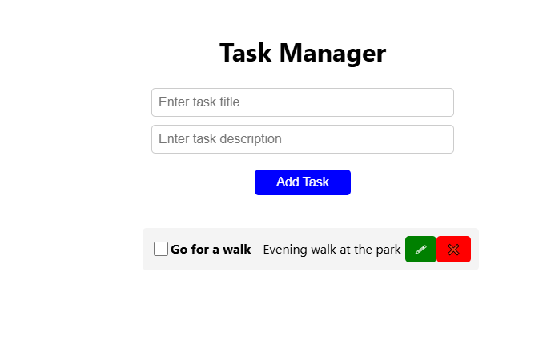
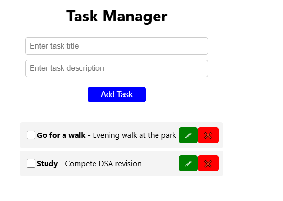
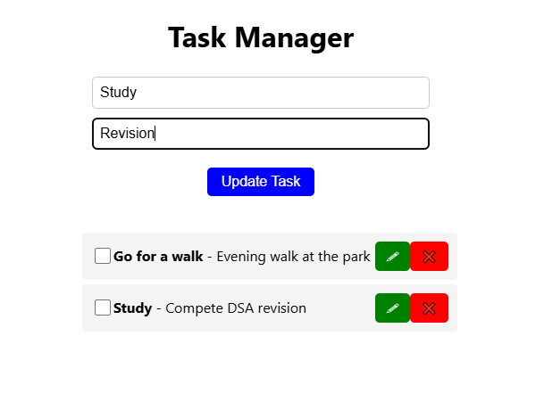
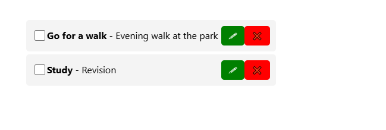
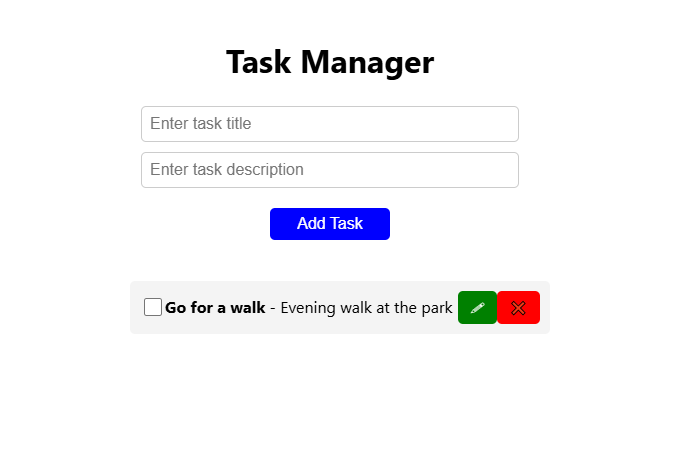

Task Manager Installation & Setup Guide
=====================================

Prerequisites
-------------
Ensure you have the following installed on your system:
- Node.js (Latest LTS version) - https://nodejs.org/
- MongoDB (Ensure MongoDB is installed & running) - https://www.mongodb.com/
- Postman (For API testing, optional) - https://www.postman.com/
- Git (Optional, for cloning the repository) - https://git-scm.com/

Installation Steps
------------------

1. Clone the Repository
```sh
git clone "url"
cd task-manager
```

2. Setup the Backend (Server)
```sh
cd backend
```

- Install Dependencies
```sh
npm install
```

- Configure Environment Variables
  1. Create a **.env** file in the **backend** folder:
  ```sh
  touch .env
  ```
  2. Add the following environment variables in **.env**:
  ```env
  MONGO_URI=mongodb://localhost:27017/taskmanager
  PORT=5000
  ```

- Start the Backend Server
```sh
npm start
```
Backend will run on **http://localhost:5000**

3. Setup the Frontend (Client)
```sh
cd frontend
```

- Install Dependencies
```sh
npm install
```

- Start the React App
```sh
npm start
```
Frontend will run on **http://localhost:3000**

Running the Project
-------------------
Open your browser and go to:
- Frontend: http://localhost:3000
- Backend API: http://localhost:5000/tasks

API Endpoints
-------------

- Get All Tasks
```sh
POST http://localhost:5000/tasks
```


- Add a New Task
```sh
POST http://localhost:5000/tasks
Content-Type: application/json

Body
{
  "title": "Go for a walk",
  "description": "Evening walk at the park"
}
```


- Update/Patch a Task
```sh
PATCH http://localhost:5000/tasks/{task_id}
Content-Type: application/json

{
  "completed": true
}
```


- Delete a Task
```sh
DELETE http://localhost:5000/tasks/{task_id}
```


Testing the API with Postman
----------------------------
1. Open **Postman**
2. Select the HTTP method (GET, POST, PATCH, DELETE)
3. Enter the API URL (`http://localhost:5000/tasks`)
4. Add required headers (`Content-Type: application/json`)
5. Send the request and check the response

Screenshots
-----------
1) Root page (get)


2) Post (adding Study element)


3) Patch (Changing Study Description)



4) Delete (Study element)


Conclusion
----------
You have successfully set up the **Task Manager** project! Now you can add, edit, complete, and delete tasks with a seamless UI and backend.


